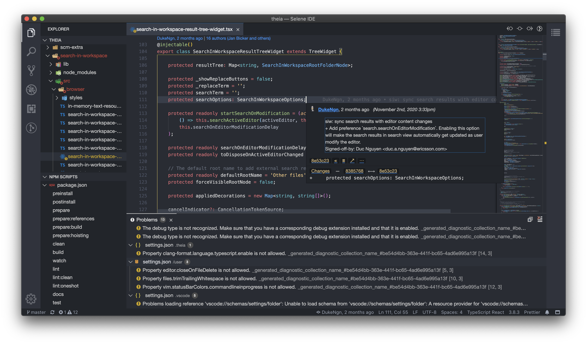

<div align='center'>
 <h1>Selene-IDE</h1>

<br>

<br>

 <div id="badges" align="center">
 [](https://github.com/DukeNgn/selene-ide/actions?query=branch%3Amaster+workflow%3Aelectron)
 [](https://github.com/DukeNgn/selene-ide/actions?query=branch%3Amaster+workflow%3Abrowser)
 </div>

 </div>

## Description

Selene is my own customized IDE, based on project [Eclipse Theia](https://github.com/eclipse-theia/theia). One can see this project as an example to illustrate how to create your own Theia-based IDE and tweak it to your needs.

<div align="center">
    
</div>

- [Main Theia Repository](https://github.com/eclipse-theia/theia)
- [Visit the Theia website](http://www.theia-ide.org) for more [documentation](http://www.theia-ide.org/doc).

## What's included?

- In addition to the vscode built-in extensions, I've added a couple of other extensions that I usually use. The full list is in the `package.json` for both `browser` and `electron` target.
- See something you don't like? Delete it from the list of plugins in `package.json` and rebuild the app.

## Build

```
yarn
```

## Electron version

```
yarn build:electron
```

#### Start the electron app

```
yarn start:electron
```

#### Package the application

```
yarn package:electron
```

#### Package a preview version of the application

```
yarn package:preview:electron
```

#### Rebuild Electron version

```
yarn rebuild:electron
```

## Browser version

```
yarn build:browser
```

#### Start the browser version

```
yarn start:browser
```

#### Rebuild Browser version

```
yarn rebuild:browser
```
